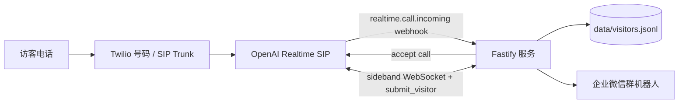

# Voice Agent 访客登记系统

这是一个工业园区入口访客登记 Demo。访客拨打 Twilio 电话号码后，Twilio 通过 SIP Trunk 将来电转到 OpenAI Realtime SIP；本服务接收 OpenAI 的 `realtime.call.incoming` webhook，调用 OpenAI accept call 接听电话，并通过 sideband WebSocket 监听 `submit_visitor` 工具调用。信息完整后，服务端校验访客信息、写入本地 JSONL 记录，并推送企业微信群机器人通知门卫。



## 当前完成情况

已实现：

- 真实电话来电 webhook 接入
- OpenAI Realtime SIP 接听电话
- sideband WebSocket 工具调用处理
- 自然对话采集车牌、来访单位、手机号、来访事由
- `submit_visitor` 服务端校验和结构化登记
- Realtime 输入音频转写兜底，减少长句信息漏抽取
- 企业微信群机器人通知
- 本地 `data/visitors.jsonl` 访客记录
- `HTTPS_PROXY` / `HTTP_PROXY` 代理支持
- Node 内置测试框架的单元和集成测试

暂未完整实现：

- 回访识别：当前已保存历史记录，但还没有把历史查询接入新通话的 Agent 上下文
- 门卫查询 Agent：例如“本周来了多少辆访客车”
- 生产数据库、重试队列、权限系统和后台 UI

## 环境变量

复制模板并填写真实值：

```powershell
Copy-Item .env.example .env
notepad .env
```

示例：

```env
OPENAI_API_KEY=sk-proj_xxx
OPENAI_WEBHOOK_SECRET=whsec_xxx
WECOM_WEBHOOK_URL=https://qyapi.weixin.qq.com/cgi-bin/webhook/send?key=xxx
PUBLIC_BASE_URL=https://your-ngrok-domain.ngrok-free.dev
PORT=8787
GUARD_MENTION_MOBILES=
```

注意：

- `.env` 不要提交到 GitHub。
- `OPENAI_API_KEY` 是 OpenAI API Key。
- `OPENAI_WEBHOOK_SECRET` 是 OpenAI webhook signing secret。
- `PUBLIC_BASE_URL` 填 ngrok / Cloudflare Tunnel 的公网 HTTPS 根地址，不要带 `/webhooks/openai`。
- 如果企业微信 Webhook 或 OpenAI Key 泄露，需要立刻重新生成。

## 本地启动

要求 Node.js 20 或以上。

安装依赖：

```powershell
npm install
```

普通启动：

```powershell
npm run dev
```

如果本地网络不能直连 `api.openai.com`，需要通过代理启动。比如本机代理端口是 `7890`：

```powershell
cd 文件夹路径
$env:HTTPS_PROXY="http://127.0.0.1:7890"
$env:HTTP_PROXY="http://127.0.0.1:7890"
npm run dev
```

启动时看到下面日志，说明代理已生效：

```text
[proxy] using http://127.0.0.1:7890/ for HTTPS requests
```

## 本地检查

健康检查：

```powershell
Invoke-RestMethod http://localhost:8787/healthz
```

测试企业微信推送：

```powershell
Invoke-RestMethod `
  -Uri "http://localhost:8787/dev/wecom-test" `
  -Method Post `
  -ContentType "application/json" `
  -Body '{"plate":"\u6caaA12345","company":"\u84dd\u8272\u9cb8\u9c7c\u79d1\u6280","phone":"13800001234","reason":"\u9001\u8d27"}'
```

构建、测试和安全检查：

```powershell
npm test
npm audit
```

## OpenAI 和 Twilio 配置

本地服务通过 ngrok 暴露：

```text
https://your-ngrok-domain.ngrok-free.dev -> http://localhost:8787
```

OpenAI webhook endpoint 填：

```text
https://your-ngrok-domain.ngrok-free.dev/webhooks/openai
```

Event type 只需要选择：

```text
realtime.call.incoming
```

Twilio Elastic SIP Trunk 的 Origination URI 填：

```text
sip:proj_xxx@sip.api.openai.com;transport=tls
```

这里的 `proj_xxx` 是 OpenAI Project ID，不是 OpenAI API Key。Twilio 电话号码需要绑定到这个 SIP Trunk。

## 演示流程

1. 启动 ngrok 或 Cloudflare Tunnel。
2. 启动本服务。
3. 拨打 Twilio 电话号码。
4. 按自然语言说出访客信息，例如：

```text
沪A12345，来蓝色鲸鱼送货，手机号 13800001234。
```

5. 终端应出现类似日志：

```text
received OpenAI webhook event
[openai] accepting incoming call ...
[openai] accepted incoming call ...
[openai] connecting sideband websocket ...
[openai] submit_visitor tool called ...
[wecom] webhook response ...
```

6. 企业微信群收到结构化访客登记消息。

## 技术选型说明

首版选择 OpenAI Realtime SIP，而不是自建 Twilio Media Streams 或 PJSIP/Asterisk 音频桥。原因是自建音频桥需要处理 RTP、音频编码、VAD、打断和低延迟播放等细节，工程风险更高。当前题目的核心是 25 秒内跑通“电话接入、自然对话、结构化登记、微信通知”的闭环，所以我优先选择低延迟语音能力更完整的 Realtime SIP。

微信通知选择企业微信群机器人，而不是个人微信自动化。个人微信方案通常依赖非官方 Hook，稳定性和合规风险较高；企业微信机器人是官方 Webhook 形态，更适合门卫通知场景。

数据存储首版使用 JSONL，而不是数据库。原因是 Demo 阶段重点是端到端链路和对话体验，本地 JSONL 足够记录和复盘；代码中保留了 `VisitorStore` 和 `Notifier` 接口，后续可以替换成 PostgreSQL、Neon、SQLite 或其他通知渠道。

## 回访识别状态

当前版本会把每次登记写入 `data/visitors.jsonl`，但还没有实现自动回访识别。理想的下一步是增加 `lookup_recent_visit` 工具：

- 如果 SIP header 里能拿到来电号码，开场前按来电号码查询最近记录。
- 如果拿不到来电号码，则先问车牌，再按车牌查询最近记录。
- 命中历史记录后，用确认式话术，例如“今天还是来蓝色鲸鱼送货吗？”
- 用户确认后直接调用 `submit_visitor`，减少重复采集。

这个功能没有硬凑进首版，主要是为了优先保证主链路稳定。

## 排障记录

- 如果 `/healthz` 失败，说明服务没有启动，或 `.env` 校验失败。
- 如果 webhook 到了但没有接听，检查日志里的 `eventType`，应为 `realtime.call.incoming`。
- 如果 accept call timeout，说明本地服务访问不了 `api.openai.com`，需要设置 `HTTPS_PROXY` / `HTTP_PROXY`。
- 如果 OpenAI 返回 `Unknown parameter`，说明 accept call payload 里有当前接口不接受的字段，需要按错误里的 `param` 收敛参数。
- 如果 Agent 口头说登记完成，但企业微信没收到，检查日志中是否有 `[openai] submit_visitor tool called` 和 `[wecom] webhook response`。
- 如果长句信息记录不全，检查是否出现 `[openai] transcript fallback updated` 和 `[openai] merged submit_visitor arguments`。服务端会优先使用模型工具参数，并用 Realtime 转写文本补齐缺失字段。
- PowerShell 里 `curl` 是 `Invoke-WebRequest` 别名，建议用 `Invoke-RestMethod`。
- PowerShell 中文 JSON 可能出现编码问题，本地测试命令使用 Unicode escape。

## Demo 计时

计时从 Agent 第一声开始，到企业微信群收到消息结束，不包含拨号振铃时间。录屏时建议同时展示手机通话、服务日志和企业微信群消息。
