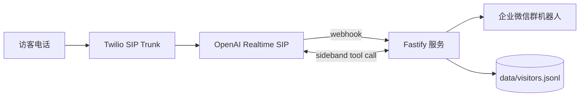

# Voice Agent 访客登记系统

工业园区入口语音访客登记 Demo：访客拨打 Twilio 号码，OpenAI Realtime SIP 接听并自然采集车牌、来访单位、手机号和事由；服务端校验后推送企业微信群机器人，并写入本地 JSONL 记录。



## 环境变量

复制 `.env.example` 为 `.env`，不要提交真实密钥：

```env
OPENAI_API_KEY=sk-proj_xxx
OPENAI_WEBHOOK_SECRET=whsec_xxx
WECOM_WEBHOOK_URL=https://qyapi.weixin.qq.com/cgi-bin/webhook/send?key=xxx
PUBLIC_BASE_URL=https://your-ngrok-domain.ngrok-free.dev
PORT=8787
GUARD_MENTION_MOBILES=
```

## 本地运行

要求 Node.js 20+。

```powershell
npm install
npm run dev
```

如果本地网络无法直连 OpenAI：

```powershell
$env:HTTPS_PROXY="http://127.0.0.1:7890"
$env:HTTP_PROXY="http://127.0.0.1:7890"
npm run dev
```

## 外部配置

OpenAI webhook：

```text
https://your-ngrok-domain.ngrok-free.dev/webhooks/openai
event: realtime.call.incoming
```

Twilio SIP Trunk Origination URI：

```text
sip:proj_xxx@sip.api.openai.com;transport=tls
```

`proj_xxx` 是 OpenAI Project ID，不是 API Key。Twilio 电话号码需要绑定到该 SIP Trunk。

## 测试

```powershell
npm test
Invoke-RestMethod http://localhost:8787/healthz
```

企业微信本地测试：

```powershell
Invoke-RestMethod -Uri "http://localhost:8787/dev/wecom-test" -Method Post -ContentType "application/json" -Body '{"plate":"\u6caaA12345","company":"\u84dd\u8272\u9cb8\u9c7c\u79d1\u6280","phone":"13800001234","reason":"\u9001\u8d27"}'
```

## 说明

已实现电话接入、自然对话采集、Realtime 转写兜底、企业微信推送和本地记录。回访识别和门卫查询 Agent 目前保留数据与接口扩展点，未作为首版主链路实现。
